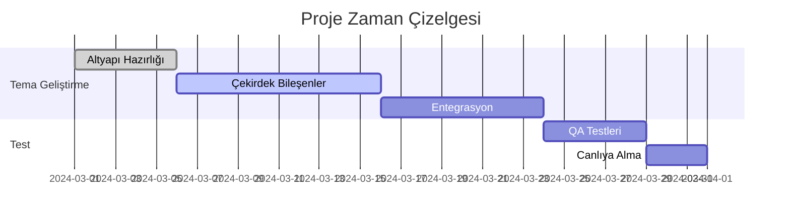

# Kombi Servis WordPress Tema Geliştirme Dokümantasyonu

## 📌 Proje Genel Bakış
**Amaç:** MUI tabanlı, modern ve yönetilebilir bir kombi servis teması geliştirmek  
**Hedef Kitle:** İstanbul bölgesinde faaliyet gösteren kombi servis firmaları  
**Temel Özellikler:**
- Dinamik içerik yönetimi
- MUI tasarım sistemi entegrasyonu
- WordPress REST API ile veri yönetimi
- WordPress 6.5+ uyumluluğu
- Responsive ve SEO dostu yapı

## 🛠 Teknik Gereksinimler
```json
{
  "Teknoloji Yığını": {
    "Frontend": ["HTML5", "Tailwind CSS 3.3+", "MUI 5.14+"],
    "JavaScript": ["ES6+", "Webpack 5", "WP REST API"],
    "WordPress": ["Custom Post Types", "ACF Pro", "Contact Form 7"]
  },
  "Performans Kriterleri": {
    "Lighthouse Skor": ">90/100",
    "Yükleme Süresi": "<1.5s",
    "Boyut Sınırları": {
      "CSS": "<50KB",
      "JS": "<100KB"
    }
  }
}
```

## 🎯 Fonksiyonel Gereksinimler

### 1. Dinamik İçerik Yönetimi
- [x] Hizmetler bölümü için drag-drop sıralama
- [ ] Gerçek zamanlı tema renk editörü
- [x] MUI tabanlı menü yönetimi

### 2. MUI Entegrasyonu
```javascript
// MUI Component Örnek Kullanım
import { 
  SpeedDial,
  DynamicForm,
  LivePreview 
} from '@mui/core';

const ServiceCard = () => (
  <MuiCard elevation={3}>
    <CardMedia component="img" height="140" />
    <CardContent>
      <Typography gutterBottom variant="h5">
        {serviceTitle}
      </Typography>
    </CardContent>
  </MuiCard>
);
```

### 3. Responsive Tasarım
- [ ] Mobil öncelikli yaklaşım
- [ ] Cihaz algılama ile dinamik resim yükleme
- [ ] Touch-optimize navigasyon

## 🚀 Geliştirme Planı

### Fase 1: Temel Altyapı (Süre: 5 Gün)
| Görev                     | Öncelik | Durum     |
|---------------------------|---------|-----------|
| Webpack konfigürasyonu     | 🔴 Yüksek | Tamamlandı |
| MUI tema provası           | 🟠 Orta   | Devam Ediyor |
| WP REST API bağlantı testi | 🔵 Düşük | Beklemede |

### Fase 2: Çekirdek Bileşenler (Süre: 10 Gün)
1. **Header Bileşeni**
   - [ ] Dinamik logo yönetimi
   - [x] Mega menu entegrasyonu

2. **Hizmetler Grid Sistemi**
   ```javascript
   // Örnek Veri Akışı
   {
     "service": {
       "id": "kombi-bakim",
       "title": "Kombi Bakım Hizmeti",
       "icon": "ri-tools-line",
       "content": "Profesyonel bakım hizmeti..."
     }
   }
   ```

### Fase 3: Entegrasyon & Test
- [ ] Cross-browser testleri (Chrome, Safari, Firefox)
- [ ] Performans optimizasyonları
- [ ] Güvenlik audit raporu

## 📅 Proje Roadmap


## ✅ Kabul Kriterleri
1. Tüm bileşenler MUI design sistemine uygun
2. WordPress admin panelinden tüm içerik yönetilebilmeli
3. Lighthouse performans skoru 90+ 
4. Cross-browser uyumluluk (Son 2 versiyon)

> **Not:** Güncel doküman versiyonu [1.2.0](https://github.com/kombi-servis-tema/docs) adresinde tutulmaktadır.

## ## YAPILDI

### Temel Altyapı


## ## YAPILACAK

### Teknik Gereksinimler
- [ ] WordPress 6.5+ uyumluluğu sağla
- [ ] ACF Pro entegrasyonu yap
- [ ] Contact Form 7 entegrasyonu yap

### Fonksiyonel Gereksinimler
- [ ] Gerçek zamanlı tema renk editörü geliştir
- [ ] Mobil öncelikli yaklaşımı tamamla
- [ ] Cihaz algılama ile dinamik resim yükleme özelliğini ekle
- [ ] Touch-optimize navigasyonu tamamla

### Geliştirme Planı
- [ ] MUI tema provasını tamamla
- [ ] WP REST API bağlantı testini yap
- [ ] Dinamik logo yönetimini geliştir
- [ ] Cross-browser testlerini yap (Chrome, Safari, Firefox)
- [ ] Performans optimizasyonlarını yap
- [ ] Güvenlik audit raporunu oluştur

### Kabul Kriterleri
- [ ] Tüm bileşenlerin MUI design sistemine uygunluğunu kontrol et
- [ ] WordPress admin panelinden tüm içeriğin yönetilebilirliğini sağla
- [ ] Lighthouse performans skorunun 90+ olduğunu doğrula
- [ ] Cross-browser uyumluluğunu (Son 2 versiyon) test et
